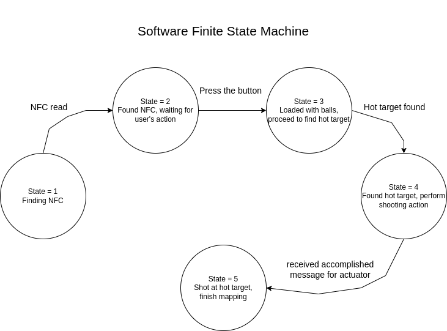

<h1> auto_nav </h1>

Performing autonomous maze exploration using wall following algorithm. Automatically detect NFC for loading ping pong ball. Autonomous aiming and firing at hot target.

## What does the code have

Provided that your robot has the similar design like our robot, this repository includes all the necessary code to perform an autonomous exploration of a 2D maze, detect NFC tag to stop and fire ping pong ball at hot targets. For details of the design of our robot, you can go to our [Documentation](Robot%20Documentation.pdf) file to read about the details of our robot.

- [self_exploration.py](self_exploration.py) file is the code for our exploration algorithm. The code structure bases on a Finite State Machine as shown below: 

- [actuation.py](actuation.py) file contains the code for our sensors on the Turtlebot3. The code continously read NFC, IR sensor and a button at a rate of 10Hz and reports the value to the exploration program through the 3 topics ```/hot_target```, ```/nfc``` and ```/button```.

- [base_code](base_code) folder contains all the original files that comes with the initial fork from [shihchengyen's r2auto_nav repository](https://github.com/shihchengyen/r2auto_nav).
- [test_code](test_code) folder contains all the python scripts to test sensor components on the Turtlebot3. Refer to the [Documentation](Documentation.pdf) for details.
- [Documentation](Documentation) file refers to the detail of our design including mechanical and electrical designs.

## Configuration for your own environment

### self_exploration.py
- Under <b> #some variable to tune your bot</b>, you can change ```wall_following_dir``` to decide which side of the wall your robot will follow. Only the value of 1:  <b>Right Wall Following</b> and -1: <b>Left Wall Following</b> are allowed.
- Inside the attributes of the class, you can adjust ```self.fsm``` to decide which state you want to start with. Please refer to the diagram above.

### actuation.py
Under constants, you can change :
- ```heat_threshold``` which determines the target detection temperature threshold and ```firing_threshold``` which determines the firing temperature threshold to fit your needs.

## How to install and run your code

In your laptop:
- Create a ROS2 package and clone this repository into that package using ```git clone git@github.com:nguyen2001ag/r2autonav.git```. Make sure to edit the setup.py file to run the code.
- Build the package.

In the RPi on the TurtleBot:
- Create a ROS2 package and copy [actuation.py](actuation.py) file into that package. Make sure setup.py is edited to include the code.
- Build the package.

Running Instructions:
- ssh into the Raspberry Pi on the Turtlebot.
- Start the bringup from the RPi on the TurtleBot: ```roslaunch turtlebot3_bringup turtlebot3_robot.launch```
- Start rslam from your laptop: 
  ``` ros2 launch turtlebot3_cartographer cartographer.launch.py ```
- Start the actuation code from the RPi on the TurtleBot: 
  ```ros2 run <package_name> <entry_point_specified_in_the_setup.py> ```
- Start the wall following code from your laptop: 
  ```ros2 run <package_name> self_exploration ```